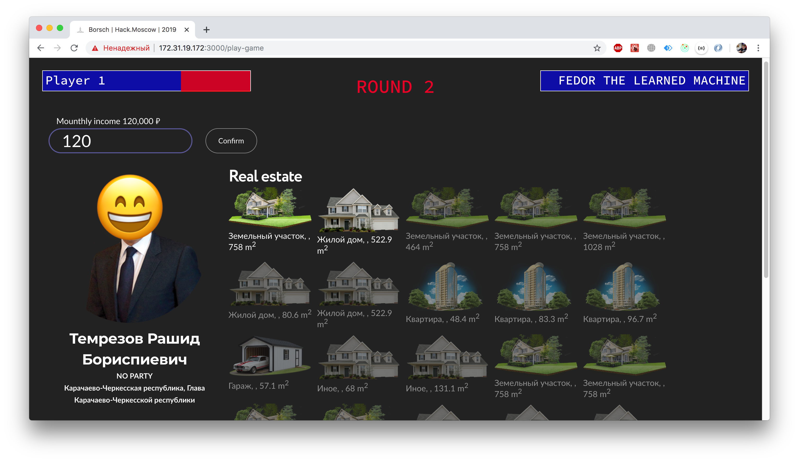

# CORRUPTION KOMBAT

Data Visualization | Hack.Moscow | Transparency

By Borsch crew

-------------------

## App for social Goods

Society knows too little about those who run the state. Government reports and statistics do not reveal comprehensive information on costs of state machinery to citizens

So, Anti-corruption declarations can be used to directly acquaint citizens with the property status of officials through the game

## Game

Best citizens were selected to challenge artificial intelligence to determine real income of public officials. 

Try to win: http://134.209.94.143:8080/

## Screenshoots

  

  

  

## Borsch crew

1. [Sergey Kurochkin](https://github.com/kurochkinSergei) Frontend-developer
2. [Maksim Shevchenko](https://github.com/maks-sh) Data scientist

